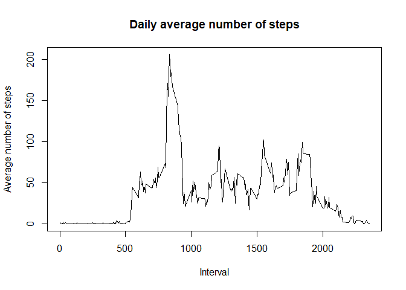

Marcelo Jarretta  
January/2021

## Loading and preprocessing the data

The data is in a zip file (**activity.zip**) located in the root of repository. The 
file **actitivy.csv** is extracted from the zip file and then loaded in the **data** variable. 
The column **date** is converted from s character to a date class and a subset of the **data**
variable is created, filtering the row where **steps** column is NA


```r
library(dplyr)
library(rockchalk)
library(ggplot2)

unzip("activity.zip",files=c("activity.csv"))
data <- data.frame(read.csv("activity.csv"))
data$date <- as.Date(data$date)
dataclean <- data %>% filter(!is.na(steps))
```

## What is mean total number of steps taken per day?

To respond this question, first the data (using the data filtered - **dataclean**) was 
grouped by **date** and then summarized taking the **sum of steps** for each day.  
The **mean** and **median** variables was calculated using **mean()** and **median()** 
functions in the column summarized in the previous step.


```r
totalperday <- dataclean %>% group_by(date) %>% summarise(sumsteps=sum(steps))
mean <- mean(totalperday$sumsteps)
median <- median(totalperday$sumsteps)
hist(totalperday$sumsteps,
     xlab="Number of steps by day",main="Total number of steps taken per day",breaks=10)
```

<!-- -->

The mean of the total number of steps taken per day
is **10766.2**, and the median is **10765.0**


## What is the average daily activity pattern?

For this question, first the data(using again the data filtered - **dataclean**) was
grouped by **interval** and then summarized taking the **mean of steps** for each interval.  
The **maximum** value was calculated using **filter()** function in the column summarized in the previous step. 


```r
meanperinterval <- dataclean %>% group_by(interval) %>% summarise(meansteps=mean(steps))
maxinterval <- meanperinterval %>% filter(meansteps==max(meansteps))
plot(meanperinterval$interval,meanperinterval$meansteps,type="l",xlab="Interval",
     ylab="Average number of steps",main="Daily average number of steps")
```

<!-- -->

The maximum number of steps occurs in interval **835**

## Imputing missing values

To complete the steps values that is missing, was used a strategy of impute the average 
number of steps for the interval. Before the impute of missing data, the total number of NAs
and the percent of the total data have been calculated.  
For the impute data, first a merge between the original data (**data**) and the data calculate in the last
question (**meanperinterval**). The column **meansteps** was rounded and then converted to integer. 
Using the **mutate()** function, the NA values have been replaced with **meansteps** values. Than the 
columns was filtered and the arranged to stay equals the original data.


```r
totalNAs = sum(is.na(data$steps))
percent = (totalNAs/length(data))/100
dataimputed <- merge(data,meanperinterval,by="interval")
dataimputed$meansteps <- as.integer(round(dataimputed$meansteps))
dataimputed <- dataimputed %>% mutate(steps=replace(steps,is.na(steps),meansteps))
dataimputed <- dataimputed[,c("steps","date","interval")] %>% arrange(date,interval)

totalperday <- dataimputed %>% group_by(date) %>% summarise(sumsteps=sum(steps))
mean <- mean(totalperday$sumsteps)
median <- median(totalperday$sumsteps)
hist(totalperday$sumsteps,
     xlab="Number of steps by day",main="Total number of steps taken per day",breaks=10)
```

<!-- -->

The total number of missing values is **2304**. 
It's **7.68 %** of the total data (**17568** rows).   

The mean of the total number of steps taken per day, using the new data with imputed values, 
is **9369.2**, and the median is **10395.0**  
The imputed data changed the mean and the median of the data.

## Are there differences in activity patterns between weekdays and weekends?

To analyze the differences in activity patterns between weekdays and weekends first a factor column **weekday**
was created. Than the labels have been grouped in **weekday** and **weekend** in factor column.  
GGPLOT2 was used to create the plot, using facet to create two plots, one for each factor. 


```r
dataimputed$weekday <- as.POSIXlt(dataimputed$date)$wday
dataimputed$weekday <- as.factor(dataimputed$weekday)
dataimputed$weekday <- combineLevels(dataimputed$weekday,levs=c("1","2","3","4","5"),newLabel = c("weekday"))
dataimputed$weekday <- combineLevels(dataimputed$weekday,levs=c("0","6"),newLabel = c("weekend"))

meanperintervalweekday <- dataimputed %>% group_by(interval,weekday) %>% summarise(meansteps=mean(steps))
ggplot(meanperintervalweekday,aes(interval,meansteps)) + 
  facet_grid(weekday~.) + 
  geom_line() + 
  ggtitle("Average number of steps by interval") + 
  labs(y="Average number of steps",x="Interval")
```

<!-- -->

We can see clearly that are more activities in weekend, besides a peak of activities in the morning in weekdays.
